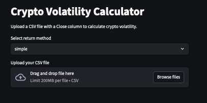
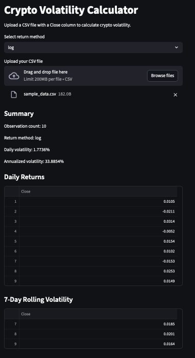

# Crypto Volatility Calculator

A Python project that calculates cryptocurrency volatility from CSV closing-price data. The app supports simple returns, log returns, daily volatility, annualized volatility, and 7-day rolling volatility through both a command-line script and a Streamlit interface.

## Why I Built This

I built this project to practice financial data handling, return calculations, volatility modeling, input validation, testing, and lightweight app development in Python. The goal was to keep version 1 focused and readable while still making it useful enough.

## Features

- Reads a CSV file with a `Close` column
- Validates price data before calculations
- Calculates simple returns
- Calculates log returns
- Calculates daily volatility
- Calculates annualized volatility using 365 periods per year
- Calculates 7-day rolling volatility
- Includes a command-line version in `main.py`
- Includes a Streamlit app in `app.py`
- Includes automated tests with `pytest`

## Tech Stack

- Python
- pandas
- numpy
- Streamlit
- pytest

## Project Structure

```text
volatility_calculator/
├── app.py
├── main.py
├── README.md
├── requirements.txt
├── sample_data.csv
├── test_volatility.py
└── volatility.py
```

## How It Works

The calculator reads a CSV file, extracts the `Close` price series, validates the data, computes daily returns, then calculates volatility metrics.

### Formulas

**Simple return**

```text
r_t = (P_t / P_t-1) - 1
```

**Log return**

```text
r_t = ln(P_t / P_t-1)
```

**Daily volatility**

```text
daily volatility = standard deviation of daily returns
```

**Annualized volatility**

```text
annualized volatility = daily volatility × sqrt(365)
```

The project uses `365` trading periods because crypto markets trade every day.

## CSV Format

Your CSV file must include a `Close` column.

Example:

```csv
Date,Close
2026-03-01,95000
2026-03-02,96000
2026-03-03,94000
2026-03-04,97000
```

## Run the Command-Line Version

1. Create and activate a virtual environment
2. Install dependencies
3. Run the script

```bash
python3 -m venv .venv
source .venv/bin/activate
pip install -r requirements.txt
python main.py
```

## Run the Streamlit App

```bash
source .venv/bin/activate
streamlit run app.py
```

## Example Output

The project returns:

- Observation count
- Daily return series
- Daily volatility
- Annualized volatility
- 7-day rolling volatility

## Testing

Run the test suite with:

```bash
pytest
```

## Validation Rules

The calculator checks for the following before running calculations:

- At least two valid price points must remain after dropping missing values
- Prices must be greater than zero
- The CSV must contain a `Close` column
- The return method must be either `simple` or `log`


## Future Improvements

- Add selectable rolling windows
- Add charts for returns and rolling volatility
- Add downloadable summary output
- Add support for stock mode with 252 trading days
- Improve app layout and styling

## App Screenshots

### Home Screen


### Results Screen



## Author

Kaique Torres